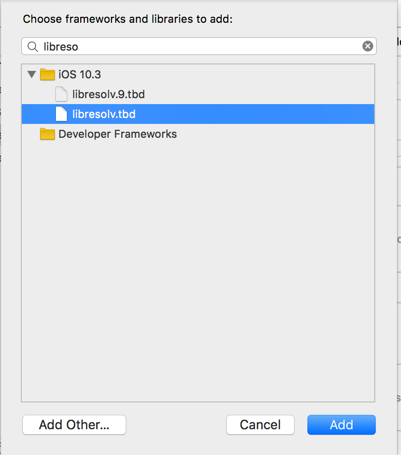
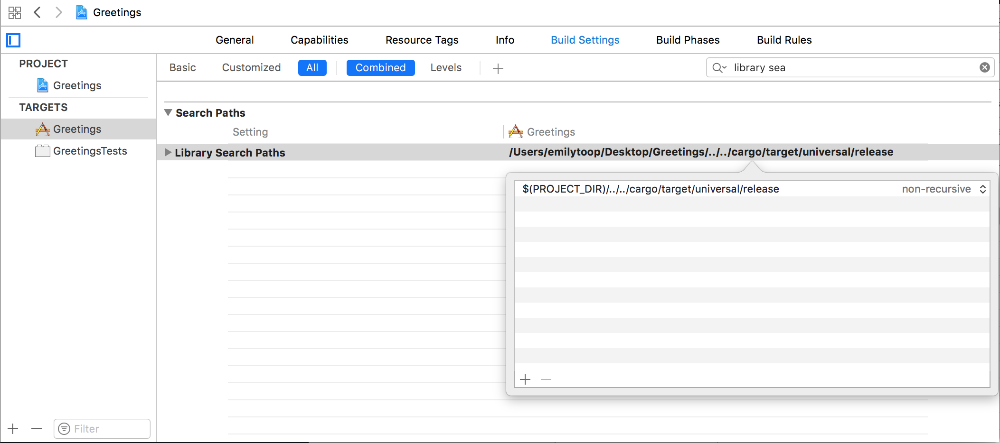

# Building and Deploying a Rust library on iOS

First, we have to [install Xcode](https://itunes.apple.com/us/app/xcode/id497799835?ls=1&amp;mt=12) and then set up Xcode build tools. If you already have the build tools installed and they are up to date, you can skip this step.
```
xcode-select --install
```

Next, we need to ensure that Rust is installed and that we can cross compile to the iOS architectures. For this we will be using [rustup](https://www.rustup.rs/). If you already have rustup installed, you can skip this step. Rustup installs Rust from the official release channels and enables you to easily switch between different release versions. It will be useful to you for all your future Rust development, not just here.
```
curl https://sh.rustup.rs -sSf | sh
```

Add the iOS architectures to rustup so we can use them during cross compilation.
```
rustup target add aarch64-apple-ios armv7-apple-ios armv7s-apple-ios x86_64-apple-ios i386-apple-ios
```

When you installed Rust, it also installed cargo, which is a package manager similar to pip, gems etc. Now we will use cargo to install `cargo-lipo`. This is a cargo subcommand which automatically creates a universal library for use with iOS. Without this crate, cross compiling Rust to work on iOS is infinitely harder.
```
cargo install cargo-lipo
```

Now we're all setup and we're ready to start. Let's create the project directory.
```
mkdir greetings
cd greetings
cargo new cargo
mkdir ios

```

`cargo new cargo` sets up a brand new Rust project with it's default files and directories in a directory called `cargo`. In this directory is a file called `Cargo.toml`, which is the package manager descriptor file, and there is be a subdirectory, `src`, which contains a file called `lib.rs`. This will contain the Rust code that we will be executing.

Our Rust project here is a super simple Hello World library. It contains a function `rust_greeting` that takes a string argument and return a string greeting that argument. Therefore, if the argument is "world", the returned string is "Hello world".

Open `cargo/src/lib.rs` and enter the following code.

```rust
use std::os::raw::{c_char};
use std::ffi::{CString, CStr};

#[no_mangle]
pub extern fn rust_greeting(to: *const c_char) -> *mut c_char {
    let c_str = unsafe { CStr::from_ptr(to) };
    let recipient = match c_str.to_str() {
        Err(_) => "there",
        Ok(string) => string,
    };

    CString::new("Hello ".to_owned() + recipient).unwrap().into_raw()
}

#[no_mangle]
pub extern fn rust_greeting_free(s: *mut c_char) {
    unsafe {
        if s.is_null() { return }
        CString::from_raw(s)
    };
}
```

Let's take a look at what is going on here.

As we will be calling this library from non-Rust code, we will actually be calling it through a C bridge.`#[no_mangle]` tells the compiler not to mangle the function name as it usually does by default, ensuring our function name is exported as if it had been written in C.

`extern` tells the Rust compiler that this function will be called from outside of Rust and to therefore ensure that it is compiled using C calling conventions.

The string that `rust_greeting` accepts is a pointer to a C char array. We have to then convert the string from a C string to a Rust `str`. First we create a `CStr` object from the pointer. We then convert it to a `str` and check the result. If an error has occurred, then no arg was provided and we substitute `there`, otherwise we use the value of the provided string. We then append the provided string on the end of our greeting string to create our return string. The return string is then converted into a `CString` and passed back into C code.

Using `CString` and returning the raw representation keeps the string in memory and prevents it from being released at the end of the function. If the memory were to be released, the pointer provided back to the caller would now be pointing to empty memory - or possibly something else entirely. But, by ensuring that the string sticks around after the function has finished executing, we have memory allocated and no longer any handle to it. That is a recipe for a memory leak, so we have to provide a second function `rust_greeting_free` that takes a pointer to a C string and frees that memory. We will have to remember to call `rust_greeting_free` from our iOS code to ensure we don't run into problems.

We also need to create our C bridge. Create a new file in `cargo/src` called `greetings.h`. Inside that file, let's define what our C interface will look like. We need to ensure that every rust function that we want to call from iOS is defined here.
```C
#include <stdint.h>

const char* rust_greeting(const char* to);
void rust_greeting_free(char *);
```

Let's build our code to make sure it works. In order to do this we have to complete our `Cargo.toml` file. This will tell cargo to create a static library and C dynamic library for our code.

```toml
[package]
name = "greetings"
version = "0.1.1"
authors = ["fluffyemily <fluffyemily@mozilla.com>"]
description = "Example static library project built for iOS"
publish = false

[lib]
name = "greetings"
crate-type = ["staticlib", "cdylib"]
```

We need to build our library against the iOS architectures using `cargo-lipo`. The built artifacts of will be placed in `cargo/target/`. The universal iOS library that we are interested in can be found in `cargo/target/universal/release/libgreetings.a`.

```
cd cargo
cargo lipo --release
```

And that's it for our Rust library. Let's get it linked with an iOS project.

Open Xcode and create a new project. Go to `File\New\Project…` and select the `iOS\Application\Single View Application` template. This template is as close to a default iOS app as it gets. Click `Next`.


Call the project `Greetings`, make it a Swift project. Click `Next` to choose the location. We are using the  ios directory that we created earlier. If you choose another location you will have to amend some of the paths that we set later. Click `Create`.


Select the Greetings project from the project navigator, and then ensure the Greetings target is selected. Open the `General` tab. Scroll down to the `Linked Frameworks and Libraries` section.


Import your `libgreetings.a` library by either dragging it in from finder, or clicking the + at the bottom of the list, clicking 'Add other...' and navigating to `cargo/target/universal/release/`. Select `libgreetings.a` and then click `Open`.

Link `libresolv.tbd`. Click the + at the bottom of the Linked Frameworks list and type libresolv into the search box. Select `libresolv.tbd` and then "Add".



iOS will need a bridging header to access the C header we created. First, let's import `greetings.h` into our Xcode project so we can link to it. Go to `File\Add files to "Greetings"...` Navigate to `greetings.h` and select `Add`.

To create our bridging header, go to `File\New\File...`. Select `iOS\Source\Header File` from the provided options and select `Next`. Name the file `Greetings-Bridging-Header.h` and select `Create`.


Open the bridging header and amend it to look like the following:
```C
#ifndef Greetings_Bridging_Header_h
#define Greetings_Bridging_Header_h

#import "greetings.h"

#endif
```

We need to tell Xcode about the bridging header. Select the Greetings project from the project navigator, and then ensure the Greetings target is selected and open the Build Settings tab. Set the `Objective-C Bridging Header` option value to `$(PROJECT_DIR)/Greetings/Greetings-Bridging-Header.h`


We also need to tell Xcode where to look for our libraries for linking. In the same Build Settings pane, amend the `Library Search Paths` option value to `$(PROJECT_DIR)/../../cargo/target/universal/release`



Build your xcode project and everything should compile.

So, now we have imported our Rust library into our iOS project and successfully linked to it. But we still need to call it. go to `File\New\File...`. Select `iOS\Source\Swift File` from the provided options and select `Next`. Name name it `RustGreetings`.


Add the following code:
```swift
class RustGreetings {
    func sayHello(to: String) -> String {
        let result = rust_greeting(to)
        let swift_result = String(cString: result!)
        rust_greeting_free(UnsafeMutablePointer(mutating: result))
        return swift_result
    }
}
```
This creates a new class that we will use as an interface to call into our Rust library. This will allow us to abstract the nuance away from the main code of the app, including conversion from a C String to a Swift String and ensures that we won't forget to call our free function and inadvertently introduce a memory leak!

Open `ViewController.swift`. Inside the `viewDidLoad` function add the following code:
```swift
let rustGreetings = RustGreetings()
print("\(rustGreetings.sayHello(to: "world"))")
```

Now build your project and run. The simulator will open and start running your app. When the view loads, "Hello world" will be output in the console window inside Xcode.

You can find the code for this on [Github](https://github.com/fluffyemily/cross-platform-rust)
